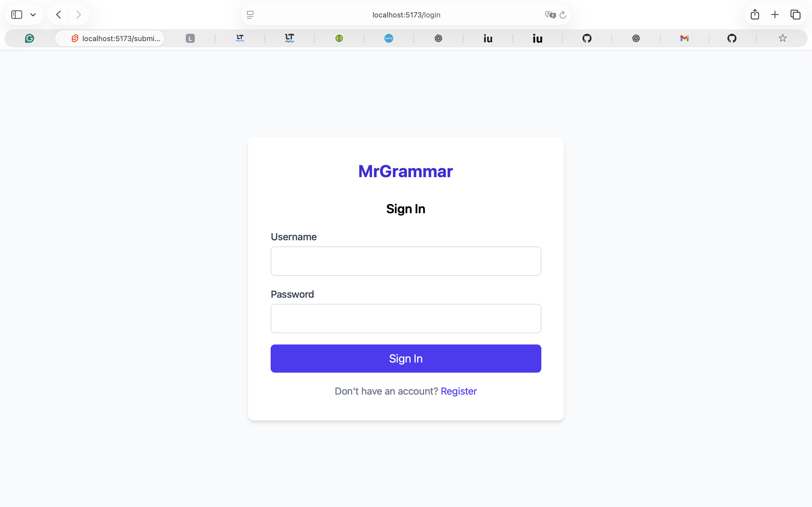
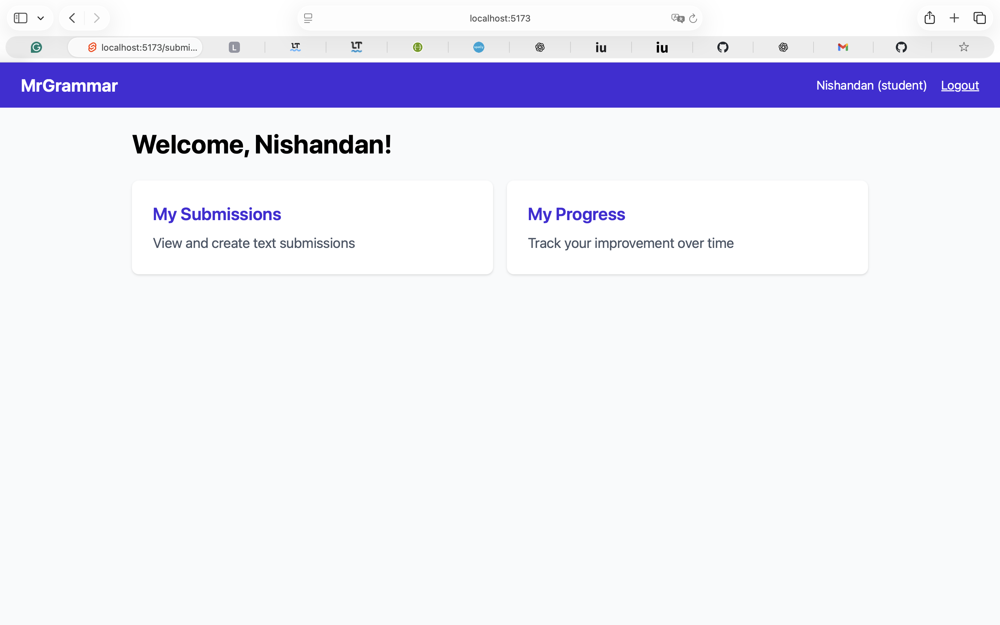
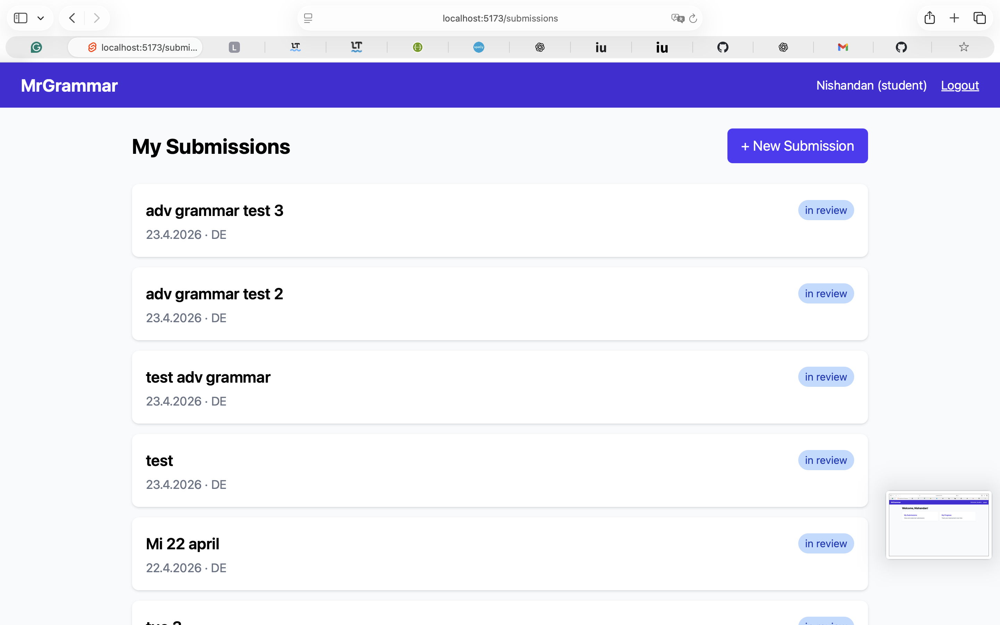
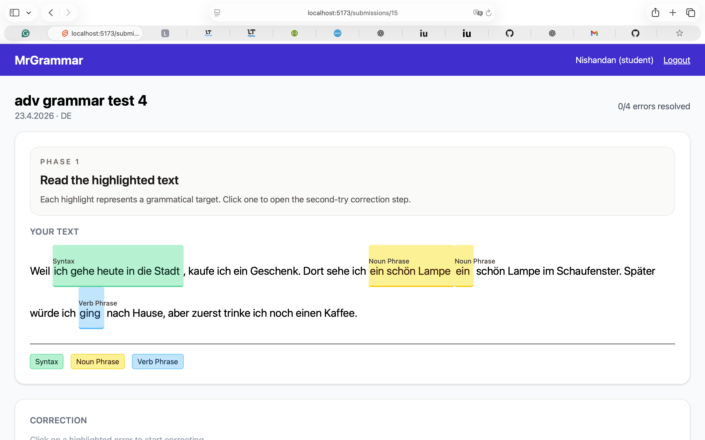
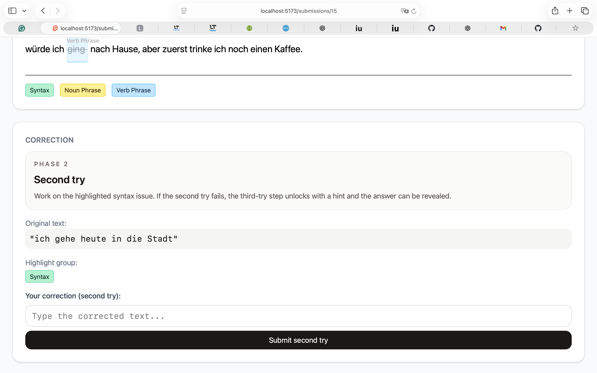
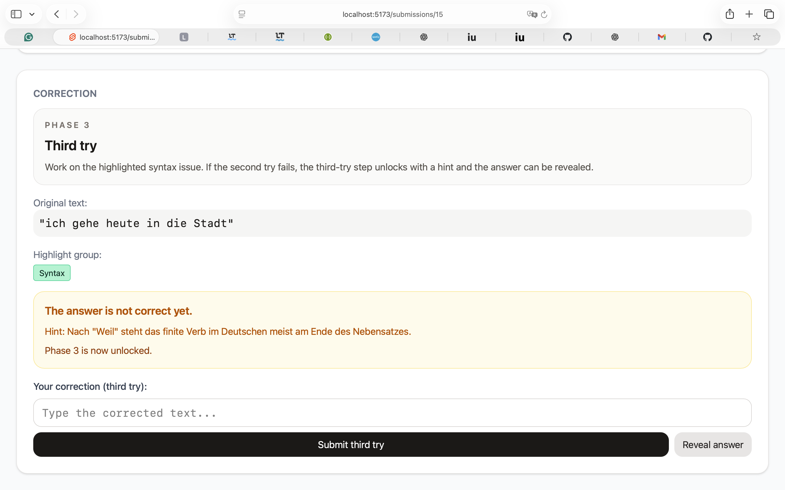

# MrGrammar

> **Public beta — still under active development.**  
> Version 0.0.7 does not yet have a production-quality NLP pipeline. Expect rough edges.

MrGrammar is a grammar-feedback platform for German language learning. The project focuses on a more active correction workflow than typical writing assistants: students should notice an error, try to fix it, receive a hint if needed, and only then see the final answer. The longer-term goal is to help teachers reduce correction workload while still getting useful insight into student progress and recurring error patterns. The current implementation now runs submission analysis asynchronously with Celery and Redis, and the learner/classroom analytics endpoints are cached in Redis for faster dashboard loads.

## Screenshots

### Login


### Student Dashboard


### Submissions List


### Post-Analysis View — Error Highlights (Phase 1)


### Correction Workflow — Second Try (Phase 2)


### Correction Workflow — Third Try with Hint (Phase 3)


---

## Acknowledgements

This project has been implemented with substantial AI assistance during development. Claude and GPT were both used to help with coding, iteration, and implementation support. Furthermore, I'm very greatful to LanguageTool for open-sourcing their rule-based server. It has helped this project immensely! With that in mind, SpaCy is one heck of a library which I am happily using. 

## Current Scope

- Django + Django REST Framework backend
- SvelteKit frontend
- PostgreSQL database
- German error detection pipeline using a self-hosted LanguageTool server and spaCy
- Async NLP analysis with Celery + Redis
- Guided correction workflow with hints and answer reveal
- Teacher and student oriented analytics foundation with cached student/classroom dashboards

## Quick Start

The easiest way to run the project locally is with Docker Compose.

```bash
cp .env.example .env   # then edit .env with your values
docker compose up --build
```

Then open:

- Frontend: `http://localhost:5173`
- Backend API: `http://localhost:8000/api/`

The Compose stack also starts Redis, a Celery worker, and Celery beat. Submission analysis now returns quickly and completes in the background, while the frontend polls for completion.

For first-time setup, run migrations in the backend container:

```bash
docker compose exec backend python manage.py migrate
```

If you want the explanation step to work, you will also need an Ollama instance reachable by the backend container. Set `OLLAMA_BASE_URL` in your `.env` file. The Docker default is `http://host.docker.internal:11434`.

## Documentation

More detailed project documentation is available in the [docs](docs/README.md) folder:

- [Architecture overview](docs/01-architecture-overview.md)
- [Data model](docs/02-data-model.md)
- [API reference](docs/03-api-reference.md)
- [Sequence diagrams](docs/04-sequence-diagrams.md)
- [Deployment notes](docs/05-deployment.md)

## Known Gaps (Beta)

### Still Need To Test

- [ ] End-to-end student workflow from submission to correction completion --> (1: after the student actually got the correct answer (after hint nr X, he must see what he did right, currently it just says "problem resolved".) 
- [ ] End-to-end teacher workflow for classrooms, submissions, and analytics views
- [ ] Authentication edge cases such as token expiry, refresh, and unauthorized access
- [ ] Role-based permissions across student, teacher, and admin accounts
- [ ] NLP quality on real student German texts, especially false positives and weak hints (still active, but it's not as important in current version, probably will be important after version < 0.2.x)
- [ ] Reliability of Ollama-generated explanations and fallback behavior when unavailable
- [ ] Frontend usability and accessibility, especially keyboard flow and error visibility
- [ ] Docker-based setup on a clean machine
- [ ] Try spacy-llm instead of plain spaCy
- [active  done in early version, but can be improved in later versions] Implement specific grammar rules from a grammar reference

### Still Need To Develop Or Improve

- [ ] Better teacher dashboards and clearer class-level analytics
- [ ] More robust learner progress tracking over time (currently returns 404)
- [ ] Stronger automated test coverage for core backend services and API flows
- [ ] Better error handling, logging, and operational diagnostics
- [ ] Security and privacy hardening for school-oriented deployment
- [ ] Configuration cleanup and environment management for development vs production
- [ ] UI polish and clearer feedback interactions in the frontend
- [ ] Documentation cleanup as the product scope stabilizes


NFRs to be done: 

NFR‑2 Reliability

NFR‑2.1 Once a text submission has been confirmed to the user, the system shall store the submission persistently so that it remains available after logout, refresh, or system restart.
NFR‑2.2 The system shall recover from a server restart without loss of already confirmed submissions.
NFR‑2.3 System errors shall be logged with at least a timestamp, user role, and affected component.

NFR‑3 Usability

NFR‑3.1 A first-time student user shall be able to submit a text and begin the correction workflow within 3 minutes without external assistance.
NFR‑3.2 A first-time teacher user shall be able to open a class overview and inspect an individual student submission within 5 minutes without external assistance.
NFR‑3.3 The interface shall present feedback in clear, non-technical language appropriate for language learners.
NFR‑3.4 The system shall provide consistent navigation and terminology across student and teacher interfaces.

NFR‑4 Accessibility

NFR‑4.1 Error categories shall not be communicated by color alone; each error highlight shall also include a text label, symbol, or tooltip. [done]
NFR‑4.3 The user interface shall remain usable at 200% browser zoom without loss of essential functionality.
NFR‑4.4 Text and interactive elements shall meet at least WCAG 2.1 AA contrast requirements.

NFR‑5 Security

NFR‑5.1 The system shall require user authentication before access to submissions, feedback history, or analytics. [Done, if we count the jwt token after login]
NFR‑5.2 The system shall enforce role-based access control so that users can access only data permitted by their role.
NFR‑5.3 The system shall terminate inactive sessions after 15 minutes of inactivity.
NFR‑5.4 All communication between client and server shall be encrypted using HTTPS.
NFR‑5.5 If local passwords are used, they shall be stored only as salted cryptographic hashes and never in plain text.

NFR‑6 Privacy and Data Protection

NFR‑6.1 The system shall collect and store only personal data necessary for authentication, text feedback, and progress tracking.
NFR‑6.2 The system shall provide a privacy notice explaining which learner data are stored and for what purpose.
NFR‑6.3 The system shall allow authorized administrators to delete or anonymize personal data in accordance with school retention policy.
NFR‑6.4 Student texts and learner analytics shall not be shared with unauthorized users or external services without explicit administrative approval.

NFR‑7 Compatibility

NFR‑7.1 The system shall support the latest two stable versions of Safari, Google Chrome, Microsoft Edge, and Mozilla Firefox.
NFR‑7.2 The system shall be optimized for desktop and laptop use; mobile support is not required in version 1.0.
NFR‑7.3 The system shall remain fully usable on displays with a minimum resolution of 1366 × 768.

NFR‑8 Maintainability

NFR‑8.1 The system shall separate presentation logic, application logic, and language-processing components into distinct modules.
NFR‑8.2 The source code shall be documented sufficiently for another developer to understand and extend the system.
NFR‑8.3 Core services for authentication, submission storage, and feedback workflow shall be covered by automated tests.
NFR‑8.4 Configuration values such as the maximum number of correction attempts before revealing a solution shall be modifiable without changing source code.


2.x.2 Organizational Requirements
NFR‑9 Deployment and Use Context

NFR‑9.1 The system shall be deployable on school-managed infrastructure or on an institutionally approved cloud service.
NFR‑9.2 The system shall be intended for use by enrolled students, teachers, and authorized administrators only.
NFR‑9.3 The system shall support access both on school premises and remotely from home, provided the user authenticates successfully.
NFR‑9.4 The system shall use school-managed user accounts where such accounts are available; otherwise, accounts shall be created by an administrator.

NFR‑10 Scope Constraints

NFR‑10.1 Version 1.0 of the system shall support corrective feedback for German written texts only.
NFR‑10.2 Version 1.0 shall focus on low-level language feedback (e.g., spelling, grammar, articles, prepositions, verb tense) and shall not provide automated grading of higher-level writing quality.
NFR‑10.3 The system shall not expose raw model output directly to end users without presentation through the defined feedback interface
