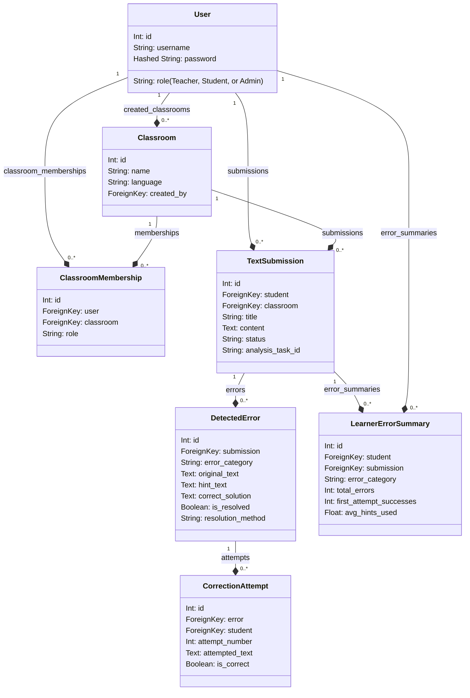

# Object Model

This document captures the canonical object model for MrGrammar as implemented in the Django backend. It is derived from the current persistent schema in `accounts`, `classrooms`, `submissions`, `feedback`, and `analytics`.

## Overview

MrGrammar is built around a learner correction workflow:
- `User` represents students, teachers, and admins.
- `Classroom` groups learners and teachers.
- `TextSubmission` records a student submission and its NLP analysis state.
- `DetectedError` stores NLP-detected mistakes, offsets, hints, and resolutions.
- `CorrectionAttempt` tracks each typed learner attempt for a detected error.
- `LearnerErrorSummary` aggregates error statistics for analytics.

The object model is strongly coupled to the submission correction workflow and asynchronous NLP analysis.

## Entities

### User

- Extends `django.contrib.auth.models.AbstractUser`
- Role choices: `student`, `teacher`, `admin`
- Relationships:
  - One teacher can create many `Classroom`
  - One user can belong to many `Classroom` through `ClassroomMembership`
  - One student can submit many `TextSubmission`
  - One student can make many `CorrectionAttempt`
  - One student can have many `LearnerErrorSummary`

### Classroom

- Fields: `name`, `language`, `created_by`, `created_at`
- Owned by a teacher via `created_by`
- Related to members through `ClassroomMembership`
- Related to submissions through `submissions`

### ClassroomMembership

- Junction table between `User` and `Classroom`
- Adds `role` metadata for classroom membership: `student` or `teacher`
- Enforces one membership record per `(user, classroom)`

### TextSubmission

- Fields: `student`, `classroom`, `title`, `content`, `language`, `status`, `analysis_task_id`, `submitted_at`, `updated_at`
- Lifecycle status choices: `submitted`, `analyzing`, `in_review`, `completed`
- Connects to detected errors and analytics summaries

### DetectedError

- Fields: `submission`, `error_category`, `severity`, `start_offset`, `end_offset`, `original_text`, `hint_text`, `correct_solution`, `languagetool_rule_id`, `spacy_pos_tag`, `error_context`, `is_resolved`, `resolution_method`, `resolved_at`, `created_at`
- Error category choices include grammar, spelling, article, preposition, verb tense, punctuation, and other
- Resolution methods include `correct`, `solution_revealed`, and `manual_reveal`
- Each detected error belongs to one submission and can have zero or more correction attempts

### CorrectionAttempt

- Fields: `error`, `student`, `attempt_number`, `attempted_text`, `is_correct`, `hint_shown`, `solution_shown`, `created_at`
- Tracks learner interaction with a detected error
- Ensures unique `attempt_number` per error

### LearnerErrorSummary

- Fields: `student`, `submission`, `error_category`, `total_errors`, `first_attempt_successes`, `avg_hints_used`, `computed_at`
- Denormalised aggregation used by the analytics layer
- Unique per `(student, submission, error_category)`

## Relationships

- `User 1 --< Classroom` via `created_by`
- `User 1 --< ClassroomMembership >-- 1 Classroom`
- `User 1 --< TextSubmission`
- `Classroom 1 --< TextSubmission`
- `TextSubmission 1 --< DetectedError`
- `DetectedError 1 --< CorrectionAttempt`
- `TextSubmission 1 --< LearnerErrorSummary`
- `User 1 --< LearnerErrorSummary`

## Enumeration summary

- `User.role`: `student`, `teacher`, `admin`
- `ClassroomMembership.role`: `student`, `teacher`
- `TextSubmission.status`: `submitted`, `analyzing`, `in_review`, `completed`
- `DetectedError.error_category`: `grammar`, `spelling`, `article`, `preposition`, `verb_tense`, `punctuation`, `other`
- `DetectedError.severity`: `low`, `medium`, `high`
- `DetectedError.resolution_method`: `correct`, `solution_revealed`, `manual_reveal`

## Workflow semantics

- A `TextSubmission` enters the system as `submitted`.
- It transitions to `analyzing` while Celery processes NLP analysis.
- When analysis completes, the submission moves to `in_review` and `DetectedError` rows are created.
- Learners correct detected errors through `CorrectionAttempt` rows.
- Errors may also be resolved via manual reveal without creating a stored attempt.
- Once all errors are resolved, the submission can reach `completed`.
- `LearnerErrorSummary` is recomputed after correction activity to support analytics.

## Derived presentation fields

These values are computed in the feedback layer and are not persisted directly:

- `display_group` and `display_label` for error highlighting
- `can_request_solution` based on attempt history and gating rules
- `next_try_number` for learner-facing correction phase labels

## Object model diagram

